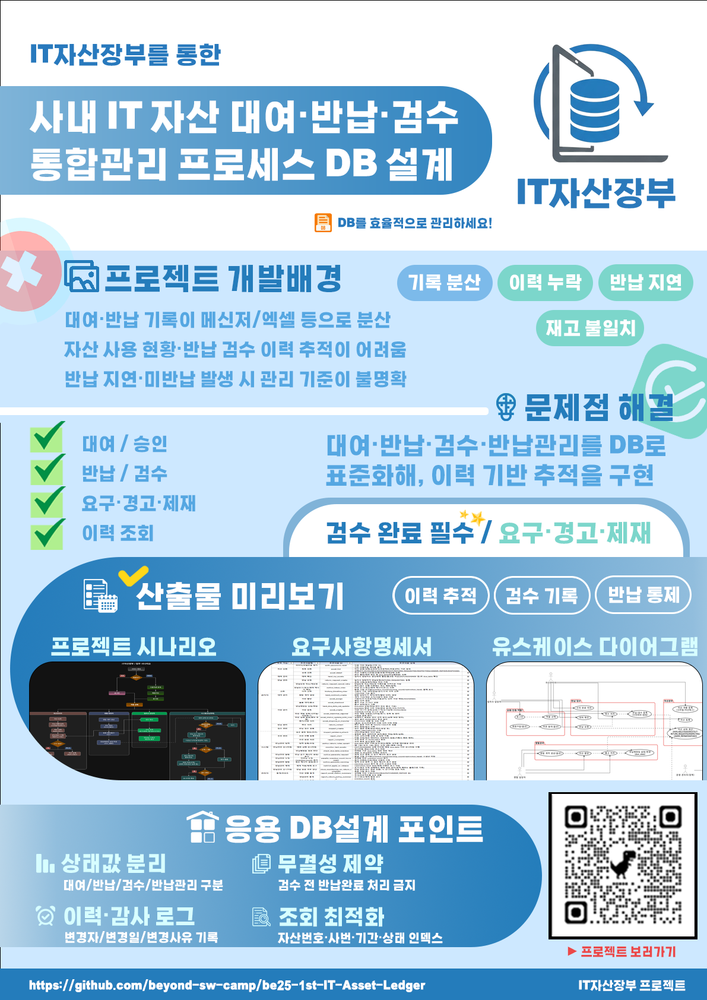
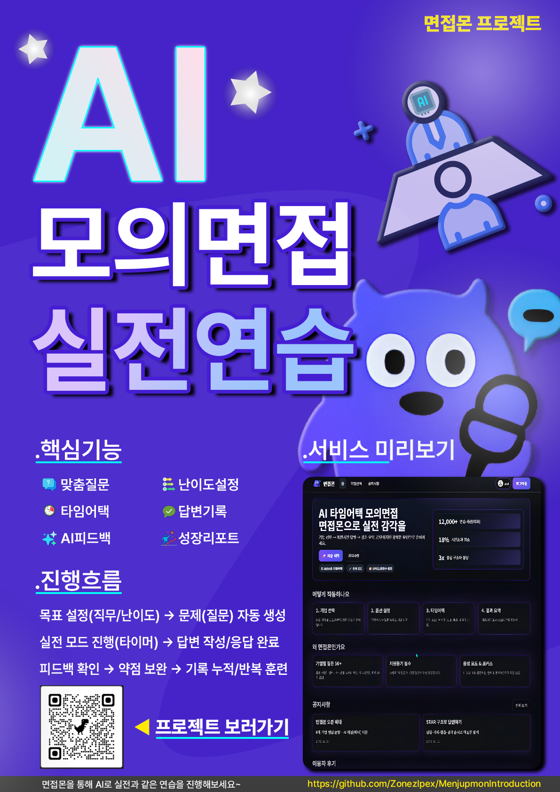
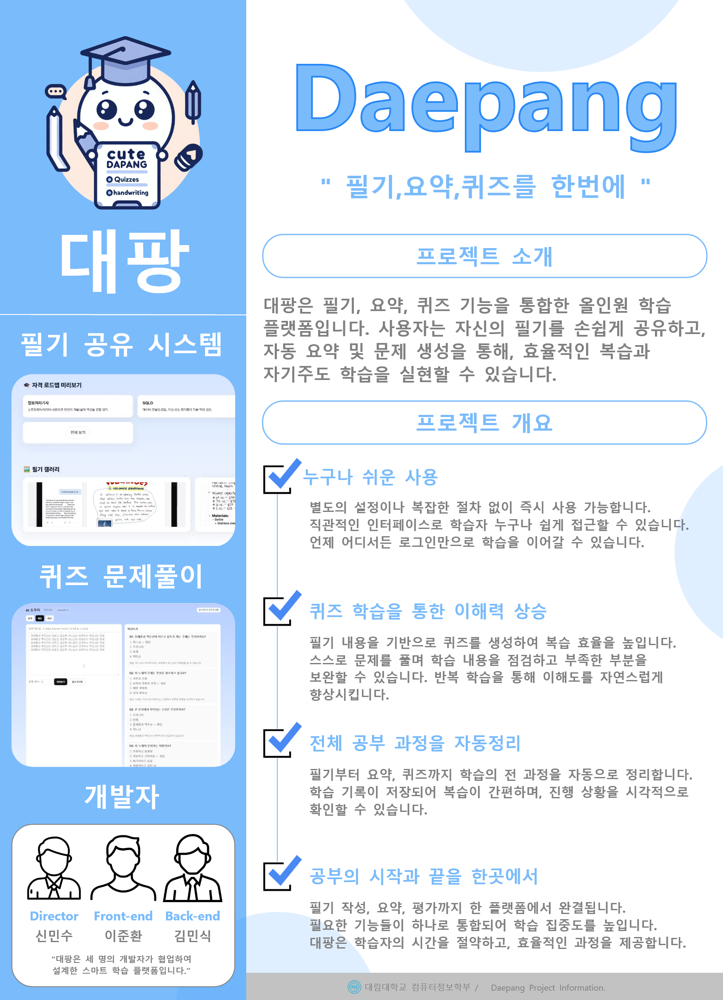
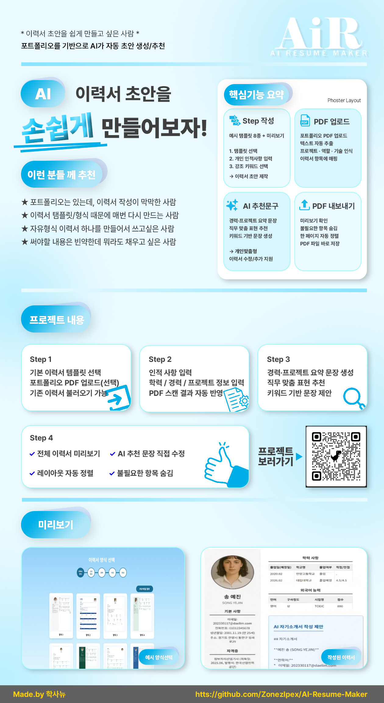

  

  
  
  
  

---

## About

IT 기술력과 디자인 감각을 바탕으로  
**조직의 운영 프로세스를 최적화하는 '디지털 행정 전문가'** 신민수입니다.

복잡한 정보를 논리적으로 구조화하여 가이드라인을 수립하고,  
기술적 이해도를 바탕으로 부서 간 소통의 병목을 해결하는 데 능숙합니다.

---

## Performance (Main Work)

<table>
  <tr>
    <td width="50%" align="center">
      
      <b>IT 자산 및 운영 관리 시스템 구축</b>
    </td>
    <td width="50%" align="center">
      
      <b>데이터 기반 운영 전략 및 매뉴얼 수립</b>
    </td>
  </tr>
  <tr>
    <td width="50%" align="center">
      
      <b>브랜드 아이덴티티 및 내부 가이드 기획</b>
    </td>
    <td width="50%" align="center">
      
      <b>비즈니스 문서 및 시각 자료 최적화</b>
    </td>
  </tr>
</table>

---

## Core Keywords

  
  
  
  
  
  

---

## Skill Set

  

---

## Major Experience

- **IT자산장부** — **[PM]** 프로젝트 자원 관리 총괄 / 인프라 관리 체계 수립
- **면접몬** — **[Lead]** 운영 가이드라인 제작 / 발표 데이터 시각화 / 시연 프로세스 설계
- **대팡** — **[Lead]** 내부 운영 시스템 기획 / 협업 툴(Notion 등) 세팅 및 관리
- **AIR** — **[Sub-Lead]** 비즈니스 모델 구조화 / 웹 인터페이스 운영 기획 지원
- **코드어드벤처** — 사내 홍보 콘텐츠 및 보고서 리소스 제작

---

## Contact & Links

- **Portfolio**: [zonezipex.github.io](https://zonezipex.github.io/)
- **Blog (Technical)**: [content467.tistory.com](https://content467.tistory.com/)
- **Email**: aksvmfkd3@naver.com

  

